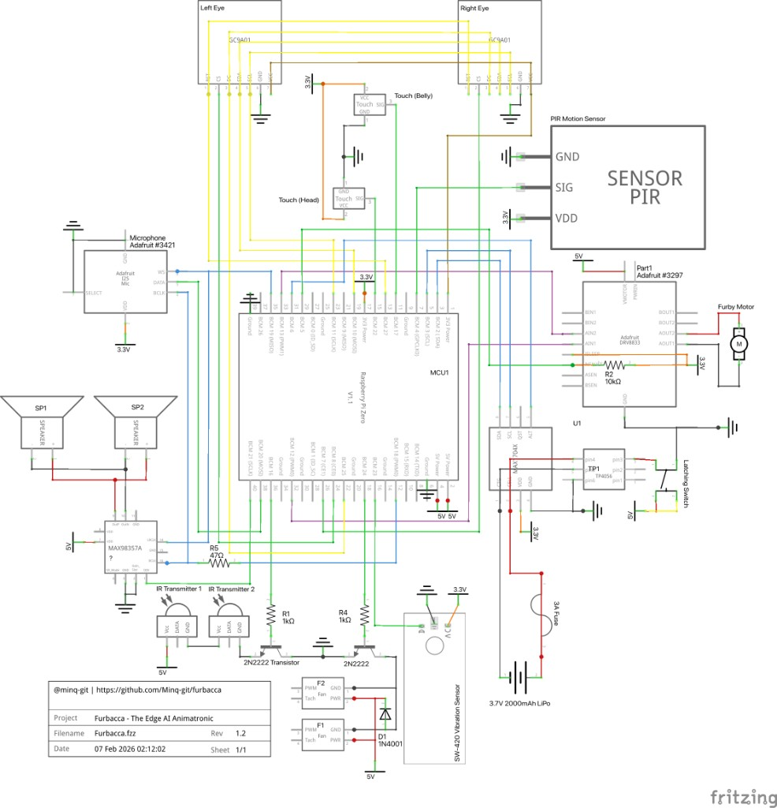

# 🐾 Project Furbacca

An AI-powered, Matter-enabled animatronic build based on the 2012 Hasbro Furby, running on a Raspberry Pi Zero 2 WH.

**Platform:** Raspberry Pi Zero 2 WH (with headers) | **OS:** Debian Trixie (Testing)

---

## 🛠 Architecture

Furbacca's codebase is structured around physical systems, bridging a Node.js/TypeScript nervous system with a Python hardware/graphics layer over UDP.

* **`brain/` (TS):** High-level orchestration and the Matter Lobe (Furbacca as a smart home device).
* **`vision/` (Py/TS):** Dual GC9A01 circular LCDs via SPI (`optic_nerve`), NumPy matrix rendering (`visual_cortex`), and Picamera2 IMX500 tracking (`retina`).
* **`senses/` (TS):** GPIO polling and event-driven monitoring for touch and spatial awareness.
* **`voice/` (TS):** ALSA audio mixing, sound playback, and vocalizations (I2S DAC).
* **`homeostasis/` (TS):** Thermal watchdogs and software PWM fan control (libgpiod).
* **`synapses/` (Shared):** The JSON schema/data contract layer bridging TS and Python via UDP (`5005`, `5006`).

---

## 🚀 Quick Start

**Main Entry Point:** Start all services (eyes, nervous system, and eye-tracking).

```bash
./.scripts/wake-furbacca.sh
# OR use the alias if configured:
wake-furbacca
```

**Safe Shutdown:** Safely halt the Pi to prevent SD card corruption or inductive kickback from the fans.

```bash
sleep-furbacca
```

### Updating / Rebooting After Code Changes

After pulling or syncing new code onto the Pi, rebuild TypeScript and restart the stack:

```bash
cd ~/furbacca
npm run build:pi
./.scripts/wake-furbacca.sh
```

If you installed the systemd service instead of running manually:

```bash
cd ~/furbacca
npm run build:pi
sudo systemctl restart furbacca
```

Tip: you can also halt directly from the touch sensors by holding **Head + Belly** for **30 seconds**.

### Sending Eye Commands (UDP 5005)

You can manually send commands to the eyes from the Pi or your local Mac:

```bash
# Shapes: round, sharp, half_moon, bean, oval, tilted, dome, pill, anime, concern, glare, gemini, heart, kawaii, stern, sus
./.scripts/vision/eye-command.sh shape sharp

# Types: default, human, dragon, demon
./.scripts/vision/eye-command.sh type dragon
```

*(Note: To send from a remote machine, pass the host as the first argument, e.g., `./.scripts/vision/eye-command.sh furbacca.local shape sharp`)*

---

## 🔌 Hardware & Pinout

| Component | GPIO (BCM) | Physical | Notes |
| :--- | :--- | :--- | :--- |
| **AI Camera** | CSI | Ribbon | IMX500 for object/face tracking |
| **Touch (Head)** | 17 | 11 | TTP223 |
| **Touch (Belly)** | 22 | 15 | TTP223 |
| **Vibration** | 23 | 16 | SW-420 (Shaker) |
| **PIR Motion** | 4 | 7 | AM312 |
| **IR Transmitter** | 16 | 36 | 2x IR LEDs (Planned) |
| **SPI SCLK** | 11 | 23 | Shared Eye SPI |
| **SPI MOSI** | 10 | 19 | Shared Eye SPI |
| **Eye DC** | 25 | 22 | GC9A01 |
| **Eye RST** | 27 | 13 | GC9A01 |
| **Eye CS (Left)** | 8 | 24 | Display 1 |
| **Eye CS (Right)** | 7 | 26 | Display 2 |
| **Cooling Fan** | 26 | 37 | 2N2222 NPN (Active-High PWM) |
| **Audio BCLK** | 18 | 12 | MAX98357A I2S DAC |
| **Audio LRC** | 19 | 35 | MAX98357A I2S DAC |
| **Audio DIN** | 21 | 40 | MAX98357A I2S DAC |

### Schematic

*Furbacca — The Edge AI Animatronic (Rev 1.2, 07 Feb 2026).*



---

## 🔧 Installation & Setup

### 1. Fresh Pi Setup

Enable SPI (`sudo raspi-config nonint do_spi 0`) and reboot. Then, run the master setup script to install dependencies, configure zRAM, and build the environment:

```bash
cd ~/furbacca
bash .scripts/setup/setup-fresh.sh
```

### 2. Code Synchronization (Mac to Pi)

Add this alias to your local Mac's `~/.zshrc` to safely push code updates:

```bash
alias push-furbacca='rsync -avz --delete --exclude node_modules --exclude .git --exclude env --exclude dist --exclude vision/py/gc9a01py /Users/YOUR_PATH/furbacca/ minqz@furbacca.local:~/furbacca/'
```

### 3. Code Quality (Biome & Ruff)

Furbacca uses **Biome** (TypeScript) and **Ruff** (Python) for ultra-fast linting and formatting.

```bash
# Format & Lint everything (run locally)
npx @biomejs/biome check --write
ruff check --fix .
```

---

## 🏠 Matter Integration

Furbacca acts as a native Matter bridge on your network (UDP `5540`).

* **Endpoint 1 (Extended Color Light):** Controls the eyes (brightness/hue maps to species and animations).
* **Endpoints 2-4 (Generic Switches):** Expose the Head, Belly, and Shiver sensors to your smart home.

**To Pair:**
Check the logs during startup for the QR code URL and manual pairing code, or run:

```bash
./.scripts/matter/show-matter-pairing.sh
```

---

## 📝 Troubleshooting

**Audio/I2S is dead or no mic (arecord -l empty):**

* Run `./.scripts/diagnostics/audio-check.sh`.
* Use **one** audio overlay only. For DAC + mic (hearing), use `dtoverlay=googlevoicehat-soundcard`. Ensure `dtparam=audio=off` and `dtparam=i2s=on`. Do **not** add both `googlevoicehat-soundcard` and `max98357a` — that leaves no capture device. Setup-fresh adds the correct overlay; if you have both, remove the max98357a line and reboot.

**One or both displays are black / corrupted:**

* Shared SPI buses can occasionally glitch during high-load startups. Trigger a hardware reset by running `./.scripts/fe-restart.sh` or by holding the **Head + Belly** sensors together for 5 seconds.

**Matter fails to start or crashes:**

* Corrupt pairing states can halt the Node.js process. Factory reset the Matter node by running `./.scripts/matter/matter-factory-reset.sh` (or `rm -rf .matter`), then re-pair the device.

**Touch sensors are unresponsive (`Device or resource busy`):**

* Another process is locking the `gpiomon` pins. Stop all services (`sudo systemctl stop furbacca-eyes`), kill zombie processes (`sudo killall gpiomon`), and restart `wake-furbacca`.

**Network drops under heavy load:**

* Hold **Belly** for 15 seconds. The nervous system will trigger `./.scripts/diagnostics/heal-network.sh` to restart the Wi-Fi stack and recover connection.
